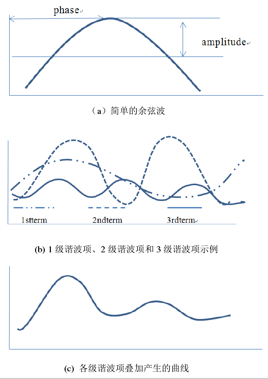

### What is HANTS?

HANTS谐波分析法的核心是傅里叶变换和最小二乘法拟合，它将每个独立数据点的时间曲线表达为一系列正弦和余弦波加性项的和，每一个余弦波由唯一振幅和相位确定, 将这些连续的谐波项叠加起来就生成一条复杂而平滑的曲线[1]。

### 谐波叠加

### Parameters[2,3]
| 参数 | 介绍 | 经验值 |
| --- | --- | --- |
| n | 频率数，n越大拟合越精细，同时计算量越大 | 2~5 |
| ouliter_reject | 可以理解为上下包络线，None则处中间 | 'Hi'，'Low'，'None' |
| Low~High | 低阈值，高阈值 | 如植被NDVI: 0~1；8bit: 0~255 |
| FET | 错误拟合容许偏差 | NDVI：0.05；8bit：5？ |
| DOD | 加上dod后如果点的数量达到曲线拟合所需的最小值，则迭代停止。这是一项保护措施 | ？ |
| Delta | 阻尼因子，消除杂散震荡 | 0.5 |

### 重构示意

### Reference

[1] 张霞等, 谐波改进的植被指数时间序列重建算法.遥感学报,2010.14(03):p.437-447.

[2] [Reconstruction of global MODIS NDVI time series: Performance of Harmonic ANalysis of Time Series (HANTS)](https://www.sciencedirect.com/science/article/pii/S0034425715001145#bb0180)

[3] [Github HANTS Code](https://github.com/pckujawa/harmonic_analysis_of_time_series/blob/master/hants/__init__.py)