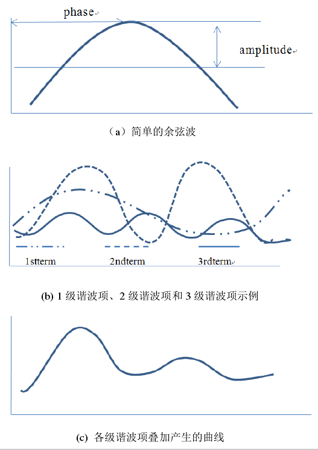

### What is HANTS?

HANTS谐波分析法的核心是傅里叶变换和最小二乘法拟合，它将每个独立数据点的时间曲线表达为一系列正弦和余弦波加性项的和，每一个余弦波由唯一振幅和相位确定, 将这些连续的谐波项叠加起来就生成一条复杂而平滑的曲线<sup>[1]</sup>。


### 谐波叠加




### Parameters<sup>[2,3]</sup>

| 参数 | 介绍 | 经验值 |
| --- | --- | --- |
| n | 频率数，n越大拟合越精细，同时计算量越大 | 2~5 |
| ouliter_reject | 可以理解为上下包络线，None则处中间 | 'Hi'，'Low'，'None' |
| Low~High | 低阈值，高阈值 | 如植被NDVI: 0~1；8bit: 0~255 |
| FET | 错误拟合容许偏差 | NDVI：0.05；8bit：5？ |
| DOD | 加上dod后如果点的数量达到曲线拟合所需的最小值，则迭代停止。这是一项保护措施 | ？ |
| Delta | 阻尼因子，消除杂散震荡 | 0.5 |


### 重构示意


```JavaScript
exports.HarmonicRegression = function(imageCollection, fitBand, harmonics, date_start, date_end, step){
 
  /* Parameters
    imageCollection: imageCollection
    fitBand: select a band to apply harmonic regression, such as, 'VV', 'NDVI, etc.
    date_start/date_end: begin/end date of reconstruct ImageCollection
    step: time interval of reconstruction
  */
  
  var bandNameList = imageCollection.first().bandNames()
  date_start = ee.Date(date_start)
  date_end = ee.Date(date_end)
  
  // Step1: Add Harmonic Regression Variables ################
  if (harmonics === undefined) harmonics=3 //increase number of harmonics for a better fit. But runs into memory issues for too many harmonics.
   
  //generate names for the harmonic components: ['sin1','sin2','sin3']
  var sincoefnames=ee.List.sequence(1, harmonics)
      .map(function(n) { return ee.Number(n).int().format("sin%d")});
  var coscoefnames=ee.List.sequence(1, harmonics)
      .map(function(n) { return ee.Number(n).int().format("cos%d")});
  
  //names of the non-harmonic independ variables.
  var timevar=ee.String('t');
  var constant=ee.String('constant'); 
  //name of the dependent variable
  var dependent = ee.String(fitBand);
  
  // This field contains UNIX time in milliseconds.
  var timeField = 'system:time_start';
  
  //function to add variables for a constant, time, and harmonic components (independents) to imagery.
  var addIndVar = function(image) {
    // Compute time in fractional years since the epoch.
    var date = ee.Date(image.get(timeField));
    var years = date.difference(ee.Date('1970-01-01'), 'year');
    var timeRadians = ee.Image.constant(ee.List.sequence(1, harmonics)).multiply(years).multiply(2*Math.PI).float();//figure this out

    return ee.Image(image)
      .addBands({srcImg: ee.Image.constant(1),overwrite: true})
      .addBands(ee.Image.constant(years).float().rename('t'))
      .addBands(ee.Image(timeRadians).cos().rename(coscoefnames))
      .addBands(ee.Image(timeRadians).sin().rename(sincoefnames))
      .copyProperties(image, ["system:time_start"])
  };
  
  imageCollection = imageCollection.map(addIndVar)
  
  
  // Step2: Apply Harmonic Regression by ee.Reducer.linearRegression 
  
  // Use these independent variables in the harmonic regression. --> ee.List(['constant', 't', 'cos', 'sin']);
  var harmonicIndependents = ee.List([constant]).add(timevar).add(coscoefnames).add(sincoefnames).flatten();
  
  // Regression of independent variables (constant, time, sin and cos coefficients) versus dependent (band)
  // harmonicTrend --> Image: [coefficients, residuals]
  var harmonicTrend = imageCollection
    .select(harmonicIndependents.add(dependent))
    .reduce(ee.Reducer.linearRegression(2 + harmonics*2, 1));
  
  // Turn the array image into a multi-band image of coefficients.
  var harmonicTrendCoefficients = harmonicTrend.select('coefficients')
    .arrayProject([0])
    .arrayFlatten([harmonicIndependents]);
  
  //The model which will return "fitted" or modelled NDVI values 
  var applyModel = function(image) {
    return image.addBands(
      image.select(harmonicIndependents)
        .multiply(harmonicTrendCoefficients)
        .reduce('sum')
        .rename(fitBand+'_hants'));
  };
  
  // Apply the model to get fitted values - apply the model and return "fitted" or modelled NDVI values
  var fittedHarmonic = imageCollection.map(applyModel)
    .select(bandNameList.add(fitBand+'_hants'))
  
  // ######################## Reconstruct Time Series By User Defined Time Step ########################
  // ################ Step1: Create Empty ImageCollection By Date ################
    //Function to make images with dates
  function makeImgsWithDates(date){
    date = ee.Date(date)
    var das = date.difference(date_start,'day').int()
    var newimg = ee.Image()
    .set("system:time_start", date.millis())
    .set('system:index', ee.String(das))
    .set('date', date.format('YYYY-MM-dd'))
    .set('DOY', date.format('DD'))
    .set('DAS', ee.String(das))
    return newimg;
  }
  
  var days = ee.List.sequence(0, date_end.difference(date_start, 'day'), step)
    .map(function(d){ return date_start.advance(d, 'day') })
  
  //Create emtpy ImageCollection
  var emptyCollection = ee.ImageCollection(days.map(makeImgsWithDates));
  
  // ################ Step2: Apply Harmonic Regression ################
  var fullSeriesHarmonic = emptyCollection.map(addIndVar).map(applyModel);
  fullSeriesHarmonic = fullSeriesHarmonic.select([fitBand+'_hants'],[fitBand])
  
  return [fittedHarmonic,fullSeriesHarmonic]
}
```

### Reference

[1] 张霞等, 谐波改进的植被指数时间序列重建算法.遥感学报,2010.14(03):p.437-447.

[2] [Reconstruction of global MODIS NDVI time series: Performance of Harmonic ANalysis of Time Series (HANTS)](https://www.sciencedirect.com/science/article/pii/S0034425715001145#bb0180)

[3] [Github HANTS Code](https://github.com/pckujawa/harmonic_analysis_of_time_series/blob/master/hants/__init__.py)